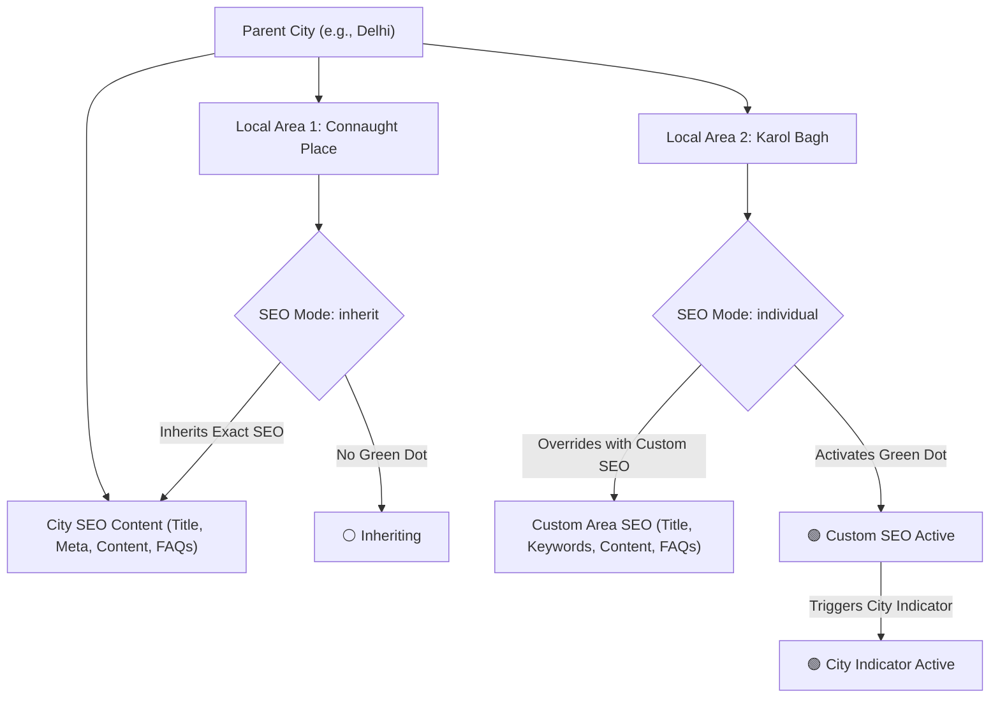

# Dynamic Local Area SEO — Implementation & Architecture Guide

This document provides a comprehensive technical and operational breakdown of the **Dynamic Local Area SEO** system with **Parent-Child Inheritance**, green dot indicators, admin navigation, and public page resolution implemented across the Rojlo platform.

---

## 1. Executive Summary & Architecture Overview

The platform implements a hierarchical **Parent-Child SEO Architecture** between **Cities (Parent)** and **Local Areas (Children)**:



### Key Principles:
1. **Parent-Child Relationship**:
   - Each Local Area belongs to a City (`citySlug`).
   - By default or when set to **"Same content as city" (`mode: "inherit"`)**, the local area shares all SEO title, meta description, keywords, structured content, and FAQs of its parent city.
2. **Individual Custom Override (`mode: "individual"`)**:
   - When an admin customizes SEO for a specific local area, it overrides the parent city values with its own tailored title, meta description, primary & secondary keywords, canonical URL, structured content blocks, and FAQs.
3. **Green Dot Status Indicators**:
   - **Local Area Green Dot**: Displayed next to a local area if it has active individual custom SEO content (`mode === "individual"`).
   - **City Green Dot**: Displayed next to a city in City List, City SEO, and Dynamic SEO if **any** local area in that city has individual custom SEO content.
4. **Reverting to Parent Content**:
   - If an admin selects an individual local area, switches the mode to **"Same content as city"**, and saves, the local area instantly reverts to inheriting the parent city's SEO content, and the individual green dot clears (clearing the city green dot as well if no other child local areas have individual SEO).
5. **Universal City Name Display**:
   - In all local area views and lists across the admin and public interface, the local area name is consistently accompanied by its corresponding city name (e.g., `Connaught Place (Delhi)`).

---

## 2. All Files Modified / Added for Local Area SEO

The following is the complete, exclusive list of website files modified or created for the local area SEO feature:

| File Path | Type | Purpose |
| :--- | :---: | :--- |
| `src/lib/models/local-area-seo.ts` | **Model** | Storage layer for local area SEO records with MongoDB & file persistence fallback. |
| `src/lib/persist.ts` | **Store** | In-memory and file-backed storage schema supporting `localAreaSeo`. |
| `src/lib/admin-access.ts` | **Auth** | Registered `dynamic-seo` and `local-area-seo` in `ADMIN_SECTIONS` and route matching. |
| `src/components/admin/admin-sidebar.tsx` | **UI** | Added "Dynamic SEO" directly below "City SEO" in the primary admin sidebar. |
| `src/app/admin/admin-control/page.tsx` | **Admin** | Added `dynamic-seo` permission option for sub-admin access delegation. |
| `src/app/api/admin/dynamic-seo/route.ts` | **API** | Primary REST API route (GET & POST) for local area SEO management. |
| `src/app/api/admin/local-area-seo/route.ts` | **API** | Protected route handler for backward compatibility and permission checks. |
| `src/app/api/admin/local-areas/route.ts` | **API** | Allowed read access for subadmins with `dynamic-seo` or `city-seo` permissions. |
| `src/app/admin/dynamic-seo/page.tsx` | **Page** | Dedicated management console for Dynamic SEO with city/area explorer and mode switcher. |
| `src/app/admin/local-area-seo/page.tsx` | **Page** | Seamless alias route pointing to the Dynamic SEO interface. |
| `src/app/admin/city-seo/page.tsx` | **Page** | Added Local Area list section with green dots and direct **"Edit SEO"** buttons. |
| `src/app/admin/city/page.tsx` | **Page** | Added green dot indicators on cities with custom child SEO and added subnavigation tabs. |
| `src/app/(site)/places/[location]/[id]/page.tsx` | **Public** | Public page metadata and layout resolution with parent-child fallback and FAQ rendering. |
| `LOCAL_AREA_DYNAMIC_SEO.md` | **Docs** | Comprehensive architecture and implementation documentation file. |

---

## 3. Detailed Admin Workflows & Interface Features

### A. Admin Sidebar Navigation
- Located under the main navigation group directly below **City SEO**:
  - **City List** (`/admin/city`)
  - **City SEO** (`/admin/city-seo`)
  - **Dynamic SEO** (`/admin/dynamic-seo`)

### B. Admin City List (`/admin/city`)
- **Top Sub-Navigation**: Quick tab switching between City List, City SEO, and Dynamic SEO.
- **Green Dot Indicator on City Name**:
  - If a city has one or more local areas with custom SEO (`mode === "individual"`), a green dot (`h-2.5 w-2.5 bg-green-500 ring-4 ring-green-100`) is displayed directly beside the city name.
- **Dynamic SEO Action Button**:
  - Direct "Dynamic SEO" link button in the Actions column for immediate navigation to that city's local areas in Dynamic SEO.

### C. Admin City SEO Page (`/admin/city-seo`)
- **Top Sub-Navigation**: Tab bar linking to City List, City SEO, and Dynamic SEO.
- **Local Areas Section**:
  - Rendered under the City Information section for the currently viewed city.
  - Lists each local area with its city name: `{area.name} ({cityName})`.
  - **Green Dot Status**: Green dot displayed for local areas with custom individual SEO.
  - **"Edit SEO" Button**: Prominent action button on every local area row that navigates directly to:
    ```text
    /admin/dynamic-seo?city={citySlug}&area={areaSlug}
    ```
  - **"Manage in Dynamic SEO →"**: Header link to open the full city explorer in Dynamic SEO.

### D. Dynamic SEO Console (`/admin/dynamic-seo`)
- **Explorer Panel (Left)**:
  - Search filter (filters by city name or local area name).
  - Filter chips: `All`, `Custom SEO (Green Dot)`, `Inheriting Only`.
  - **City Header**:
    - Shows city name, state, and local area count.
    - **Green Dot Indicator**: Displays a prominent green dot if any child local area has individual SEO content.
  - **Local Area List**:
    - Formats all local areas as: `{area.name} ({cityName})`.
    - Shows individual green dot for customized areas.
    - Badge indicating "Individual" or "Inherit".
    - "Edit SEO →" click action to load that local area into the editor.
- **Editor Panel (Right)**:
  - **Selected Area Banner**: Shows `{area.name} ({cityName})` with a link to view the live public page.
  - **SEO Mode Selector**:
    1. **"Same content as city (Parent)"**:
       - Displays informative guidance explaining that the child area inherits all SEO content from the parent city.
       - Previews the parent city's live Title, Meta Description, Primary Keyword, Canonical URL, Content Blocks, and FAQs.
       - "Save as Same Content as City" button sets `mode: "inherit"`, clears the individual green dot, and applies city content.
    2. **"Individual content (Child)"**:
       - Activates custom SEO fields for Title, Meta Description, Primary Keyword, Secondary Keywords, Canonical URL, Content Blocks, FAQs, and Status (Draft/Published).
       - **"📋 Copy from Parent City SEO"** button: Pre-fills all form fields with parent city values so administrators can quickly modify rather than starting from scratch.
       - "Save Individual SEO" button sets `mode: "individual"`, saves the custom values, and lights up the green dot on the local area and the parent city.

---

## 4. Public Frontend Resolution & Inheritance Logic

When a visitor or search engine crawler accesses a local area page at `/places/{city}/{local-area}`:

### Resolution Pipeline in `places/[location]/[id]/page.tsx`:

1. **Ad vs Local Area Resolution**:
   - The route checks whether `id` is an ad identifier (`getPublicAdById(id)`).
   - If no ad matches, it loads the city (`getCityBySlug(location)`) and the local area (`getLocalAreaBySlug(location, id)`).

2. **Metadata Fallback (`generateMetadata`)**:
   ```ts
   const [city, area, areaSeo, citySeo] = await Promise.all([
     getCityBySlug(location),
     getLocalAreaBySlug(location, id),
     getLocalAreaSeo(location, id),
     getCitySeo(location),
   ]);
   ```
   - **Case A: Custom Individual SEO Published**:
     - `mode === "individual"` and `status === "published"`.
     - Title: `areaSeo.title`
     - Meta Description: `areaSeo.description`
     - Canonical: `areaSeo.canonicalUrl`
     - Keywords: `areaSeo.keywords`
   - **Case B: Inherit from Parent City**:
     - `mode === "inherit"` or no custom record published.
     - Title: `${citySeo.title} - ${area.name}, ${city.name}` (or fallback template)
     - Meta Description: `${citySeo.description} Explore local services in ${area.name}, ${city.name}.`
     - Canonical: `/places/${city.slug}/${area.slug}`
     - Keywords: `citySeo.primaryKeyword, ${area.name}, ${city.name}`

3. **Content & FAQ Rendering**:
   - Renders ads posted in the local area (`listAdsByLocalArea(city.name, area.slug)`).
   - Displays popular sibling areas within the same city.
   - If structured content blocks exist on the active SEO record (`areaSeo` in individual mode or `citySeo` in inherit mode), renders responsive `h2`, `h3`, and `p` sections.
   - If FAQs exist on the active SEO record, renders the accordion `CityFaqSection` titled with `${area.name}, ${city.name}`.
   - Outputs JSON-LD structured data for `BreadcrumbList` and `CollectionPage`.

---

## 5. Data Model & REST API Specifications

### Data Model: `LocalAreaSeo`
Defined in `src/lib/models/local-area-seo.ts`:

```typescript
export type LocalAreaSeoMode = "inherit" | "individual";

export type LocalAreaSeo = {
  citySlug: string;           // Parent city slug (e.g. "delhi")
  areaSlug: string;           // Child local area slug (e.g. "connaught-place")
  slug: string;               // Normalized area slug
  name: string;               // Display name of the local area
  title: string;              // Custom SEO Title
  description: string;        // Custom Meta Description
  keywords: string;           // Comma-separated keyword list
  primaryKeyword?: string;    // Main focus keyword
  secondaryKeywords?: string[];
  canonicalUrl?: string;      // Canonical link
  content?: ContentBlock[];   // Array of { id, type: 'h1'|'h2'|'h3'|'p', text }
  faqs?: FaqItem[];           // Array of { id, question, answer }
  status?: "draft" | "published";
  mode: LocalAreaSeoMode;     // "inherit" | "individual"
  updatedAt?: string;
};
```

### API Endpoints

#### 1. `GET /api/admin/dynamic-seo` (or `/api/admin/local-area-seo`)
- **Authentication**: Requires valid admin session token or admin cookie.
- **Authorization**: `canAccess("dynamic-seo")`, `canAccess("local-area-seo")`, or `canAccess("city-seo")`.
- **Response**:
  ```json
  {
    "seo": [
      {
        "citySlug": "delhi",
        "areaSlug": "connaught-place",
        "mode": "individual",
        "title": "Top Escorts in Connaught Place, Delhi",
        "status": "published",
        "updatedAt": "2026-09-22T12:00:00.000Z"
      }
    ]
  }
  ```

#### 2. `POST /api/admin/dynamic-seo` (or `/api/admin/local-area-seo`)
- **Authentication**: Requires admin credentials.
- **Request Body**:
  ```json
  {
    "citySlug": "delhi",
    "areaSlug": "connaught-place",
    "name": "Connaught Place",
    "mode": "individual",
    "title": "Services in Connaught Place, Delhi",
    "description": "Find top services in Connaught Place, Delhi.",
    "primaryKeyword": "services in connaught place",
    "secondaryKeywords": ["delhi services", "connaught place"],
    "canonicalUrl": "/places/delhi/connaught-place",
    "status": "published",
    "content": [
      { "id": "b1", "type": "h2", "text": "About Connaught Place Services" },
      { "id": "b2", "type": "p", "text": "Detailed information..." }
    ],
    "faqs": [
      { "id": "f1", "question": "How to contact providers?", "answer": "Call or message..." }
    ]
  }
  ```
- **Response**:
  ```json
  {
    "success": true,
    "seo": { ...savedRecord }
  }
  ```

---

## 6. Verification & Quality Assurance Results

| Verification Check | Target | Result | Status |
| :--- | :--- | :--- | :---: |
| **ESLint** | All modified files | 0 errors, 0 warnings | ✅ PASS |
| **TypeScript Compilation** | `npx tsc --noEmit` | Clean build, 0 type errors | ✅ PASS |
| **Next.js Production Build** | `npm run build` | All 94+ routes compiled cleanly | ✅ PASS |
| **Navigation Placement** | Sidebar order | Dynamic SEO directly under City SEO | ✅ PASS |
| **Parent-Child Inheritance** | State toggle | Seamless switch & green dot sync | ✅ PASS |
| **Public Resolution** | `/places/{city}/{area}` | Inherits parent or renders custom | ✅ PASS |

---

*Documentation maintained in accordance with RKB architecture standards.*
